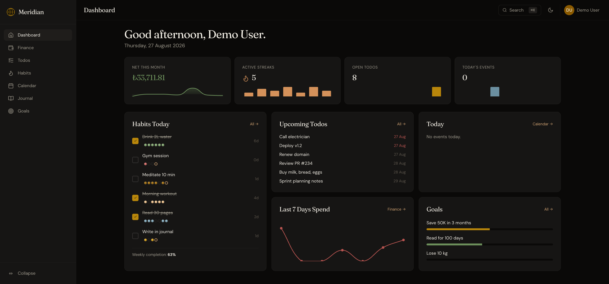
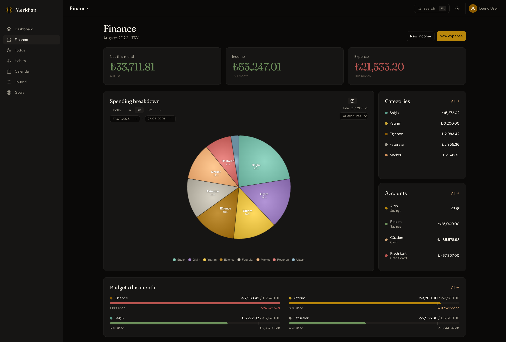

<p align="center"><sub><b>English</b> · <a href="README.tr.md">Türkçe</a></sub></p>

<h1 align="center">
  
  &nbsp;Meridian
</h1>

<p align="center"><i>Your life, beautifully organized.</i></p>

<p align="center">
  <a href="https://github.com/hamzagedikkaya/meridian/actions/workflows/ci.yml"></a>
  
  
  
  
  <a href="https://github.com/hamzagedikkaya/meridian-mobile"></a>
  <a href="LICENSE"></a>
</p>

<p align="center">
  <a href="#-quick-start">Quick start</a> ·
  <a href="#-features">Features</a> ·
  <a href="#-mobile-client">Mobile</a> ·
  <a href="#-backup--restore">Backup</a> ·
  <a href="#-design">Design</a> ·
  <a href="#-keyboard-shortcuts">Shortcuts</a>
</p>

---

Meridian is a self-hosted, local-first personal life OS. One Rails app gathers the things that usually scatter across half a dozen subscriptions — money, habits, todos, calendar, journal, goals — and keeps them on a machine you control. Backups are a single `tar.gz`, so moving your data is a copy-paste away.

<p align="center">
  
</p>

<p align="center"><sub>The dashboard, dark theme, seeded demo account.</sub></p>

## ✨ Features

- 💰 **Finance** — accounts, nested categories with roll-up, transactions, **monthly budgets with pace tracking**, subscriptions, an interactive spending-breakdown pie (preset & custom date ranges, per-account filter, click-to-drill-down), 6-month trend, multi-currency incl. gram-gold, CSV export
- ✅ **Todos** — lists, priorities, due dates, today / week / overdue filters
- 🔥 **Habits** — daily and weekly cadences, streaks, 12-week heatmap, completion rates
- 📅 **Calendar** — monthly grid plus drag-to-reschedule weekly view, iCal feed
- 📓 **Journal** — rich-text entries with mood, energy, gratitude, and tags
- 🎯 **Goals** — financial / habit / custom targets with live-calculated progress and color-coded deadline badges
- 🏠 **Dashboard** — bento-grid widgets that surface today's habits, todos, events, and spend
- 🔍 **Global search** — `⌘K` instant search across every module
- ⚡ **Quick capture** — one input, smart router: numbers become transactions, `habit:` becomes a log, freeform becomes a todo
- 📊 **Weekly review** — guided reflection with auto-summarised stats
- 🍅 **Focus timer** — pomodoro with browser notifications and per-todo time tracking
- 📈 **Insights** — cross-module patterns: weekday vs weekend spending, mood × habit correlation, most productive day
- 💾 **Backup & restore** — `pg_dump` + ActiveStorage blobs bundled into a portable archive
- 🌍 **Bilingual** — full Turkish & English UI, switchable per user
- 🎨 **Design** — Fraunces + DM Sans, dark-first amber/gold palette, optional light mode

<p align="center">
  
</p>

<p align="center"><sub>Finance: month net, interactive spending breakdown, categories, accounts and budgets on one page.</sub></p>

## 🧰 Tech Stack

| Layer | Tech |
|---|---|
| Backend | Ruby 3.3 · Rails 8 |
| Frontend | Hotwire (Turbo + Stimulus), Importmap, Tailwind v4 |
| Database | PostgreSQL 14+ |
| Background / cache | Solid Queue · Solid Cache · Solid Cable (database-backed) |
| Auth | Devise |
| Charts | Apache ECharts (finance dashboard) · Chartkick + Chart.js · groupdate |
| Money | money-rails · multi-currency, incl. custom gram-gold (GAU) |
| Recurring rules | ice_cube |
| Localization | Turkish · English (Rails I18n) |
| Backup | pg_dump · tar.gz · ActiveStorage |
| Testing | RSpec · FactoryBot · Shoulda · Capybara · SimpleCov |
| Lint / security | RuboCop (omakase + rspec) · Brakeman · EagerEye (static N+1) |

## 🚀 Quick Start

**Requirements** — Ruby 3.3.x (via `rbenv` / `asdf`), PostgreSQL 14+, Node.js 22+ (only used for the native Tailwind binary).

```bash
git clone <your-repo> meridian
cd meridian
bundle install
bin/rails db:create db:migrate db:seed
bin/dev
```

Open <http://localhost:3000>. The seed creates two accounts:

- `admin@meridian.local`
- `demo@meridian.local` — pre-populated with habits, goals, transactions, and journal entries

> **Set your own passwords.** The seeds only run unguarded in development. Anywhere else, export `SEED_ADMIN_PASSWORD` and `SEED_DEMO_PASSWORD` first — Meridian is meant to be served on a LAN, and an account with a published password is an open door for anyone on the Wi-Fi. Change or delete the demo user before exposing the server.

### Tests, lint, security

```bash
bin/rspec
bundle exec rubocop
bundle exec brakeman -i config/brakeman.ignore
```

## 📱 Mobile Client

[**Meridian Mobile**](https://github.com/hamzagedikkaya/meridian-mobile) is the companion Flutter app — Android-first, Turkish/English, talking to this server over your own Wi-Fi. It reads and writes through a JSON API under `/api/v1`, authenticated with the user's `api_token` as a bearer token:

```bash
curl -s http://localhost:3000/api/v1/health                       # unauthenticated ping
curl -s -X POST http://localhost:3000/api/v1/session \
     -d 'email=demo@meridian.local&password=YOUR_PASSWORD'        # → {token, user}
curl -s http://localhost:3000/api/v1/home -H "Authorization: Bearer $TOKEN"
```

The API covers home, finance dashboard, accounts, transactions, categories, habits, goals, journal, todos, events and quick capture. `PATCH /api/v1/me` lets the phone store the language and theme the user picked, so the choice follows the account back to the web app. Money always crosses the wire as integer `*_cents` plus the currency's `subunit_to_unit` — the phone never divides by 100 and gram-gold stays in grams.

## 💾 Backup & Restore

Backups are first-class: everything that defines "your Meridian" — schema, rows, attachments, app version — lives in a single archive.

**Create**

1. Open **Settings → Data**, or go straight to `/backups`.
2. Click **Create backup**.
3. Download the resulting `.tar.gz` from the list.

The archive contains:

- `db.dump` — full PostgreSQL dump (custom format)
- `storage/` — every ActiveStorage blob (avatars, journal attachments)
- `metadata.json` — Meridian version, schema version, timestamp

**Restore** — on the new machine, set up Meridian with the steps above, visit `/backups`, drop the archive into **Restore**, confirm. The app signs you out; sign back in with your original credentials.

> ⚠️ Restoring wipes the current database. Take a fresh backup first if there's anything you want to keep.

Full archive layout in [docs/backup_format.md](docs/backup_format.md).

## ⌨️ Keyboard Shortcuts

| | |
|---|---|
| `⌘K` / `Ctrl+K` / `/` | Global search |
| `c` | Quick capture |
| `g d` · `g f` · `g t` · `g h` | Dashboard · Finance · Todos · Habits |
| `g c` · `g j` · `g g` | Calendar · Journal · Goals |
| `Esc` | Close any modal |

## 🎨 Design

Warm near-black, cream text and a single disciplined gold — Fraunces for display, DM Sans for body. Every token lives in `@theme` inside [`app/assets/tailwind/application.css`](app/assets/tailwind/application.css); the full reference is [`docs/design_tokens.md`](docs/design_tokens.md).

<p align="center">
  
  
  
  
  
  
  
</p>

Dark is the default; light mode inverts the surfaces and keeps the accent. The mobile client mirrors the same language with its own dark-first palette.

## 📂 Module Map

```
Dashboard       (/)
├─ Finance      (/finance)
│  ├─ Transactions, Accounts, Categories, Budgets, Subscriptions
│  └─ Reports, CSV export
├─ Todos        (/todos), Todo lists (/todo_lists)
├─ Habits       (/habits)
├─ Calendar     (/calendar) — month + week, iCal feed at /calendar/feed
├─ Journal      (/journal)
├─ Goals        (/goals)
├─ Insights     (/insights)
├─ Weekly review (/weekly_reviews)
├─ Backups      (/backups)
└─ Settings     (/settings)
```

## 📄 License

Meridian is released under the [**PolyForm Noncommercial License 1.0.0**](LICENSE). Personal, research, educational, and other noncommercial use is free; commercial use is not granted by this license. Open an issue if you'd like to discuss a separate arrangement.

---

<p align="center"><sub>Meridian — your life beautifully organized.</sub></p>
